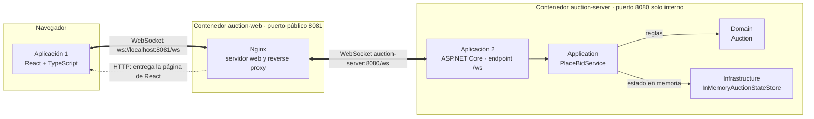
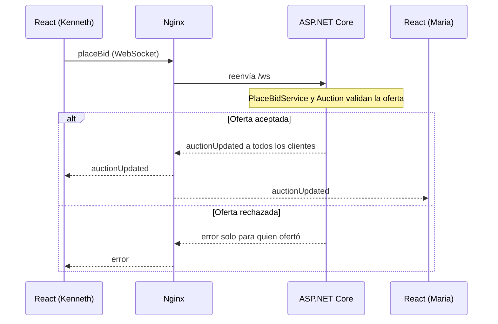

# Subasta en tiempo real con WebSockets

**Investigación II — Patrones y mecanismos en arquitecturas distribuidas**
**Tema seleccionado: WebSockets**

Este proyecto es una subasta de un solo artículo. Varias personas abren la página, ofertan y **todas ven el nuevo
precio y el ganador al instante**, sin recargar y sin que el navegador tenga que preguntar. Sirve para demostrar cómo
dos aplicaciones (un frontend en React y un backend en ASP.NET Core) se comunican mediante **WebSocket**.

Contenido:
[¿Qué es WebSocket?](#1-qué-es-websocket) ·
[Arquitectura](#2-arquitectura) ·
[Cómo ejecutar](#3-cómo-ejecutar) ·
[Cómo probar](#4-cómo-probar) ·
[Flujo de comunicación](#5-flujo-de-comunicación) ·
[Reglas y concurrencia](#6-reglas-de-negocio-y-concurrencia) ·
[Estado en memoria](#7-estado-de-la-subasta-y-base-de-datos) ·
[Backend](#8-organización-del-backend) ·
[Docker y Nginx](#9-docker-y-nginx) ·
[Estructura](#10-estructura-del-repositorio) ·
[Alcance](#11-alcance)

---

## 1. ¿Qué es WebSocket?

**WebSocket** es un protocolo que mantiene una **conexión abierta y bidireccional** entre un cliente y un servidor.
Una vez establecida, cualquiera de los dos puede enviar mensajes cuando quiera, sin esperar a que el otro pregunte.

### Por qué WebSocket en una subasta

En una subasta todos los participantes necesitan enterarse de una nueva oferta inmediatamente. Con WebSocket el
servidor mantiene una conexión abierta con cada cliente y puede enviar la actualización en cuanto ocurre el cambio,
sin que el navegador tenga que preguntar repetidamente.

### Cómo funciona

1. El navegador envía una petición HTTP normal pidiendo cambiar de protocolo (`Connection: Upgrade` y
   `Upgrade: websocket`).
2. El servidor acepta y responde **`101 Switching Protocols`**.
3. Desde ese momento la misma conexión deja de hablar HTTP y se usa para intercambiar mensajes en ambos sentidos,
   hasta que alguna de las partes la cierra.

Se usa `ws://` (sin cifrar) o `wss://` (con TLS). Este proyecto usa **WebSocket nativo**: la clase `WebSocket` del
navegador y `System.Net.WebSockets` de ASP.NET Core.

### WebSocket frente a polling

| Polling | WebSocket |
|---|---|
| El cliente pregunta cada cierto tiempo: "¿hay cambios?" | La conexión permanece abierta y el servidor envía el cambio cuando ocurre. |
| Muchas peticiones que responden "no hay nada nuevo". | Solo viajan mensajes cuando hay algo que comunicar. |
| El cambio se conoce en la siguiente consulta. | El cambio se conoce de inmediato. |

### Ventajas

- Comunicación bidireccional: el cliente envía y el servidor también.
- Actualizaciones en tiempo real.
- Conexión persistente: no se abre una conexión nueva por cada mensaje.
- Menos consultas repetitivas al servidor.
- Apropiado para subastas, chats, notificaciones y juegos.

### Desventajas

- Las conexiones permanecen abiertas y consumen recursos del servidor.
- Manejar reconexiones aumenta la complejidad.
- Hay que controlar la concurrencia: varios clientes envían mensajes a la vez.
- Los proxies y servidores intermedios deben soportar el `Upgrade` (en este proyecto se configura en Nginx).
- No siempre hace falta: para operaciones simples de tipo CRUD, HTTP tradicional es suficiente.

### Cuándo usarlo y cuándo no

| Conviene | No conviene |
|---|---|
| Subastas y ofertas en vivo | Formularios normales |
| Chats | CRUD que no necesita actualización inmediata |
| Juegos en tiempo real | Sistemas donde HTTP tradicional es suficiente |
| Paneles que se actualizan en vivo | |
| Notificaciones | |

### Alternativas

- **SignalR** (.NET): librería de alto nivel para comunicación en tiempo real. Simplifica el manejo de conexiones,
  grupos de clientes y reconexión, y usa WebSockets cuando están disponibles (si no, recurre a otros mecanismos).
  Para esta investigación **se eligió WebSocket nativo** porque permite ver directamente cómo funciona el protocolo:
  el `101`, los mensajes y el envío a cada conexión.
- **Socket.IO** (ecosistema JavaScript): librería con su propio protocolo encima de WebSocket, que agrega
  reconexión automática y salas.
- **Server-Sent Events**: el servidor envía eventos al navegador por HTTP, pero solo en un sentido.

---

## 2. Arquitectura

Las **dos aplicaciones desarrolladas** son:

| | Aplicación | Tecnología | Responsabilidad |
|---|---|---|---|
| 1 | **Frontend** (`frontend/Auction.Web`) | React + Vite + TypeScript | Se ejecuta en el navegador. Muestra el precio y el ganador actuales, permite escribir el participante y el monto, envía la oferta, recibe las actualizaciones en tiempo real y muestra el error si una oferta es rechazada. |
| 2 | **Backend** (`backend/`) | ASP.NET Core (.NET 10) | Acepta las conexiones WebSocket, procesa los mensajes, valida las ofertas, actualiza el estado y transmite las actualizaciones a los clientes conectados. |

**Nginx no es una tercera aplicación desarrollada**: es infraestructura. Sirve el build de React y actúa como reverse
proxy, redirigiendo `/ws` hacia ASP.NET Core. No contiene lógica de la subasta.



- El navegador solo conoce **`http://localhost:8081`**. Nginx reenvía `/ws` al backend por la red interna de Docker.
- El puerto `8080` del backend **no se publica** en la máquina: solo es accesible desde dentro de Docker.
- React arma la URL del WebSocket a partir de la dirección de la página (`http` → `ws`, `https` → `wss`), por lo que
  no hay servidores ni puertos escritos a mano en el código.

---

## 3. Cómo ejecutar

### Requisitos

- **Docker** y **Docker Compose** (incluido en Docker Desktop).
- **Git**, para clonar el repositorio.

No hace falta instalar Node.js, npm, el SDK de .NET, Visual Studio ni Nginx: todo se compila y se ejecuta dentro de
contenedores.

### Windows (PowerShell)

Desde la raíz del proyecto:

```powershell
.\run.ps1
```

### Linux / macOS

Desde la raíz del proyecto:

```sh
./run.sh
```

Cuando termina, el script imprime la dirección de la aplicación: **http://localhost:8081**. La primera vez descarga
imágenes y compila, así que puede tardar unos minutos.

### Detener el proyecto

```sh
docker compose down
```

---

## 4. Cómo probar

Estado inicial de la subasta: **precio 100, sin ganador**.

1. Abre **http://localhost:8081**. La página muestra `Estado: Conectado`, `Precio actual: $100` y
   `Ganador actual: ---`. El servidor envía ese estado apenas se establece la conexión.
2. Abre **una segunda pestaña** con la misma dirección. Será el **Cliente B (Maria)**; la primera es el
   **Cliente A (Kenneth)**.
3. **Kenneth ofrece 120**: en el Cliente A escribe `Kenneth` en *Participante*, `120` en *Tu oferta* y pulsa *Ofertar*.
   - Resultado en **ambas pestañas**: `Precio actual: $120` y `Ganador actual: Kenneth`, sin recargar.
4. **Maria intenta 110**: en el Cliente B escribe `Maria`, `110` y pulsa *Ofertar*.
   - Maria **recibe un error** en el panel *Mensajes*: "El monto debe ser estrictamente mayor al precio actual."
   - Kenneth **no recibe ningún error**.
   - El precio continúa en `$120` y el ganador en `Kenneth`.
5. **Maria ofrece 150**.
   - Resultado en **ambas pestañas**: `Precio actual: $150` y `Ganador actual: Maria`.

### Cliente que entra tarde

Abre una tercera pestaña después de las ofertas. Muestra **inmediatamente** `$150` y `Maria`: el servidor le envía el
estado actual al conectarse, así que no necesita esperar una nueva oferta.

### Reiniciar la demostración

Para volver al estado inicial (precio 100, sin ganador):

```sh
docker compose restart auction-server
```

### Cómo comprobar que realmente es WebSocket

1. Abre las herramientas de desarrollo del navegador (`F12`) y ve a **Network** (Red).
2. Filtra por **WS**.
3. Recarga la página.
4. Aparece una conexión a **`ws://localhost:8081/ws`** con estado **`101 Switching Protocols`**.
5. Al seleccionarla, la pestaña **Messages** muestra los mensajes que suben (↑) y bajan (↓) en cada oferta.

El código **101** significa que la conexión HTTP inicial cambió de protocolo y, a partir de ahí, se comunica por
WebSocket.

Del lado del servidor también queda evidencia en los logs:

```sh
docker compose logs -f auction-server
```

---

## 5. Flujo de comunicación

Recorrido de una oferta:

1. El usuario escribe su nombre y el monto en React (`BidForm.tsx`).
2. React envía por WebSocket un mensaje `placeBid` (`App.tsx`).
3. Nginx reenvía `/ws` hacia ASP.NET Core.
4. `AuctionWebSocketHandler` recibe el mensaje y lo convierte en una solicitud de la aplicación.
5. `PlaceBidService` coordina la operación.
6. `Auction` (dominio) valida las reglas y, si las cumple, actualiza precio y ganador.
7. `InMemoryAuctionStateStore` da acceso exclusivo al estado mientras se valida y lo mantiene en memoria.
8. Si se acepta, el backend envía `auctionUpdated` **a todos** los clientes conectados.
9. React recibe el mensaje y actualiza la pantalla sin refrescar.
10. Si se rechaza, el mensaje `error` vuelve **únicamente al cliente que ofertó**.



### Mensajes

Todos los mensajes son JSON de texto sobre el WebSocket `/ws`. Estos son los que viajan realmente:

**Cliente → servidor: `placeBid`** (lo genera `App.tsx`)

```json
{"type":"placeBid","bidder":"Kenneth","amount":120}
```

**Servidor → todos los clientes: `auctionUpdated`** (contrato `AuctionUpdatedMessage`). Se envía a todos cuando se
acepta una oferta, y solo al cliente nuevo cuando se conecta.

```json
{"currentPrice":120,"currentWinner":"Kenneth","type":"auctionUpdated"}
```

Antes de la primera oferta `currentWinner` es `null`:

```json
{"currentPrice":100,"currentWinner":null,"type":"auctionUpdated"}
```

**Servidor → solo el emisor: `error`** (contrato `ErrorMessage`)

```json
{"message":"El monto debe ser estrictamente mayor al precio actual.","type":"error"}
```

El orden de los campos dentro de un objeto JSON no tiene importancia.

---

## 6. Reglas de negocio y concurrencia

### Reglas

Las decide el backend, en la entidad `Auction` (proyecto `Auction.Domain`). Una oferta se acepta solo si:

- la subasta está activa;
- el participante está presente (no vacío);
- el nombre del participante tiene como máximo 100 caracteres;
- el monto es mayor que 0;
- el monto es **estrictamente mayor** que el precio actual.

React solo hace comprobaciones básicas de comodidad (por ejemplo, nombre no vacío y límite de 100 caracteres en el
campo); la decisión final siempre es del backend.

### Concurrencia

El backend utiliza mecanismos de sincronización para evitar que dos ofertas simultáneas actualicen el precio de forma
inconsistente y para mantener el orden de los mensajes enviados:

- **Un `lock` sobre el estado** (`InMemoryAuctionStateStore`): mientras se valida y se actualiza el precio, ninguna
  otra oferta puede entrar.
- **Procesamiento ordenado** (`AuctionWebSocketHandler`): se procesa un mensaje a la vez, incluido su envío a los
  demás, de modo que todos los clientes reciben las actualizaciones en el mismo orden.
- **Un pequeño candado por conexión** (`WebSocketConnection`): evita que dos mensajes se envíen al mismo socket al
  mismo tiempo.

---

## 7. Estado de la subasta y base de datos

**Actualmente no se utiliza una base de datos.**

El estado se mantiene con **`InMemoryAuctionStateStore`**:

- el precio actual vive en memoria;
- el ganador actual vive en memoria;
- al reiniciar el backend el estado vuelve al valor inicial (precio 100, sin ganador).

Esto es intencional: el objetivo de la Investigación II es demostrar la comunicación por WebSocket entre las dos
aplicaciones. La persistencia mediante una base de datos queda fuera del alcance de esta investigación y puede
incorporarse posteriormente en Proyecto I.

---

## 8. Organización del backend

| Proyecto | Responsabilidad |
|---|---|
| `Auction.Domain` | Reglas de negocio de la subasta (`Auction`, `Bid`). No depende de otros proyectos. |
| `Auction.Application` | Casos de uso y coordinación (`PlaceBidService`, `GetAuctionStateService`). Usa el dominio. |
| `Auction.Infrastructure` | Almacenamiento actual en memoria (`InMemoryAuctionStateStore`). |
| `WEBSOCKET` | ASP.NET Core: configuración (`Program.cs`), endpoint `/ws`, manejo de conexiones WebSocket y mensajes (carpeta `WebSockets/`). |

Dependencias: `WEBSOCKET` e `Infrastructure` usan `Application`, y `Application` usa `Domain`. El dominio no conoce
ASP.NET y la capa de aplicación no conoce WebSocket.

---

## 9. Docker y Nginx

### Docker

`docker-compose.yml` define dos servicios y crea la red interna entre ellos:

| Servicio | Contenido | Puerto |
|---|---|---|
| `auction-server` | Backend ASP.NET Core. | `8080`, solo dentro de Docker. |
| `auction-web` | React compilado + Nginx. | `8081` publicado en la máquina. |

Cada aplicación tiene su propio `Dockerfile` en dos etapas: una imagen con las herramientas de compilación (SDK de
.NET o Node) y una imagen final ligera que solo contiene el resultado (`aspnet` o `nginx`).

### Nginx

Nginx sirve el frontend React y actúa como reverse proxy. Cuando recibe `/ws`, reenvía esa conexión al backend
ASP.NET Core, incluyendo las cabeceras `Upgrade` y `Connection` que necesita WebSocket.

Por eso el navegador solo ve `localhost:8081`, aunque el backend escuche internamente en el puerto `8080`: el
navegador nunca habla directamente con el backend. La configuración está en `frontend/Auction.Web/nginx.conf`.

---

## 10. Estructura del repositorio

```
.
├── backend/
│   ├── Auction.Domain/
│   ├── Auction.Application/
│   ├── Auction.Infrastructure/
│   └── WEBSOCKET/
├── frontend/
│   └── Auction.Web/
├── tests/
├── docker-compose.yml
├── run.ps1
├── run.sh
├── WEBSOCKET.slnx
└── README.md
```

- `backend/WEBSOCKET/Program.cs` y `backend/WEBSOCKET/WebSockets/`: endpoint `/ws`, handler, conexiones y mensajes.
- `frontend/Auction.Web/src/`: `App.tsx` (conexión WebSocket) y `components/` (`AuctionCard`, `BidForm`,
  `ConnectionStatus`).
- `frontend/Auction.Web/nginx.conf`: configuración de Nginx.
- `tests/`: pruebas y evidencia.
  - `websocket-integration-test.ps1`: prueba del protocolo con clientes WebSocket reales.
  - `browser-demo-test.cjs`: el escenario de la demostración en un navegador real (Chromium).
  - `reproducibility-results.txt` y `final-validation-results.txt`: resultados de las validaciones.

---

## 11. Alcance

Este proyecto se limita a **una subasta de un solo artículo** para demostrar WebSocket. Quedan fuera y pertenecen a una
evolución posterior: usuarios y autenticación, varias subastas, historial de ofertas, cierre automático por tiempo y
persistencia en base de datos.

Además, si la conexión se pierde, la página avisa y pide recargar: no hay reconexión automática.
